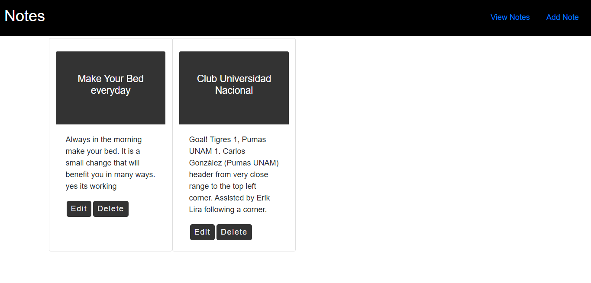

# Note-Taker-MERN
## Overview
A simple note taking application using the MERN stack. The application will enable users to add, update, delete and display their daily notes.

## Project

[Deploy] (https://notetakermemo.herokuapp.com/)

## NPM Packages
* Mongoose
* Axios
* React-router-dom

## Technologies
* Node Js
* Express Js
* React Js
* MongoDB Atlas
* flexbox

### Author
Guillermo Lara
